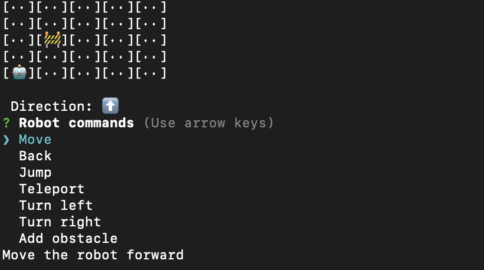

# toy-robot

Extendable CLI mini-game with an interactive toy robot

[](https://github.com/seek-oss/skuba)



## Challenge

[See coding challenge](./coding-challenge.md) for details.

The architecture has been broken down into 2 layers:

1. The game. This handles all the core game logic.
2. The CLI. This resolves user inputs into game interactions and visualises the game state.

The goal is to decouple functionality which allows you to essentially swap out the input and UI without modifying the core game.

The [extensions](https://github.com/tadhglewis/toy-robot/tree/extensions) branch includes other functionality outside the scope of this challenge.

Assumptions

- We use skuba which gracefully handles linting, testing, and all the _other concerns_ and DX not directly related to the challenge. This is fine for SEEK as it is SEEK-opinionated however you probably should use some other framework or custom setup.
- `PLACE`ing must be called first to start the game, if you don't, the game layer will throw. This is enforced in the CLI layer for flexibility reaons - potential for multiple players etc.

## Development

### Test

```shell
pnpm test
```

### Lint

```shell
pnpm format
pnpm lint
```

### Start

```shell
pnpm start
```
