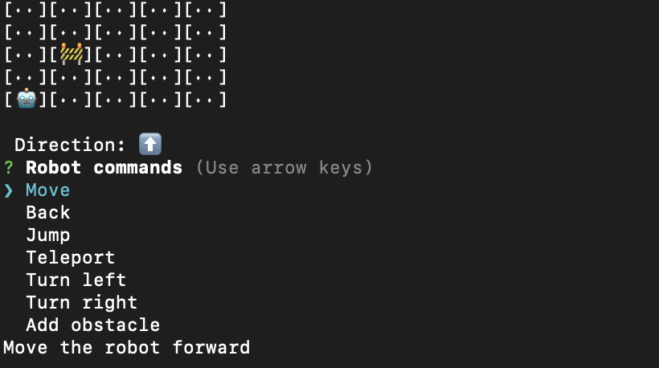

# toy-robot

Extendable CLI mini-game with an interactive toy robot

[](https://github.com/seek-oss/skuba)



## Challenge

[See coding challenge](./coding-challenge.md) for details.

Extensions to challenge:

1. Diagonal movement
2. Jumping
3. Teleporting
4. Obstacles
5. Multi robot type support

The architecture has been broken down into 2 layers:

1. The game. This handles all the core game logic.
2. The CLI. This resolves user inputs into game interactions and visualises the game state.

The goal is to decouple functionality which allows you to essentially swap out the input and UI without modifying the core game.

## Development

### Test

```shell
pnpm test
```

### Lint

```shell
pnpm format
pnpm lint
```

### Start

```shell
pnpm start
```
